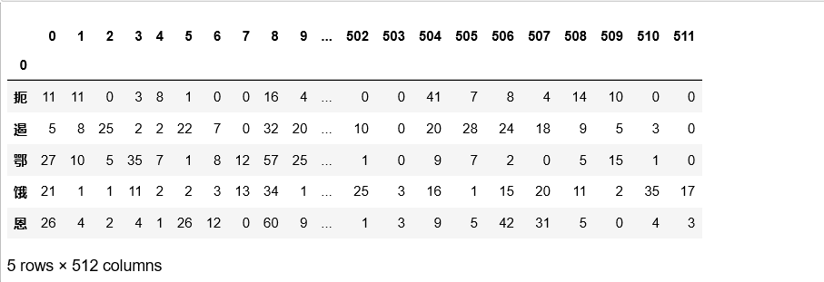

# 1 CASIA 脱机和在线手写汉字库

本章通过 Python 解析了CASIA 脱机和在线手写汉字库中的单字库，主要从以下两个方面进行展开：

1. 单字库的特征的解码、序列化与反序列化；
2. 单字库的图片的解码、序列化与反序列化。

## 1.1 CASIA 手写汉字简介

**CASIA-HWDB** （**CASIA-OLHWDB**）数据库由中科院自动化研究所在 2007-2010 年间收集，包含 $1\,020$ 人书写的脱机（联机）手写中文单字样本和手写文本，用 Anoto 笔在点阵纸上书写后扫描、分割得到。

> 本数据库经签约授权后可免费用于学术研究目的，但用于商业目的需付费。学术研究的用途包括手写 文档分割、字符识别、字符串识别、文档检索、书写人适应、书写人鉴别等。

如果需要使用该数据集需要提交申请书：

- [CASIA-HWDB](http://www.nlpr.ia.ac.cn/databases/download/CASIA-HWDB-Chinese.pdf): <http://www.nlpr.ia.ac.cn/databases/download/CASIA-HWDB-Chinese.pdf>
- [CASIA-OLHWDB](http://www.nlpr.ia.ac.cn/databases/download/CASIA-OLHWDB-Chinese.pdf): <http://www.nlpr.ia.ac.cn/databases/download/CASIA-OLHWDB-Chinese.pdf>

数据集的下载网址：[CASIA Online and Offline Chinese Handwriting Databases](http://www.nlpr.ia.ac.cn/databases/handwriting/Download.html)[^1]

[^1]: http://www.nlpr.ia.ac.cn/databases/handwriting/Download.html

在申请书中介绍了数据集的基本情况：

1. **CASIA-HWDB** 手写单字样本分为三个数据库：*HWDB1.0~1.2*，手写文本也分为三个数据库： *HWDB2.0~2.2*。
    - HWDB1.0~1.2 总共有 $3\,895\,135$ 个手写单字样本，分属 $7\,356$ 类（$7\,185$ 个汉字和 $171$ 个英文字母、数字、符号）。
    - HWDB2.0~2.2 总共有 5,091 页图像，分割为 52,230 个文本行和 1,349,414 个文字。所有文字和文本样本均存为灰度图像（背景已去除），按书写人序号分别存储。

2. **CASIA-OLHWDB** 手写单字样本分为三个数据库：*OLHWDB1.0~1.2*，手写文本也分为三个数据库： *OLHWDB2.0~2.2*。
    - OLHWDB1.0~1.2 总共有 $3\,912\,017$ 个手写单字样本，分属 $7,356$ 类（$7\,185$ 个汉字和 $171$ 个英文字母、数字、符号）。
    - OLHWDB2.0~2.2 总共有 $5\,092$ 页手写文本，分割为 $52\,221$ 个文本行和 $1\,348\,904$ 个文字。所有文字和文本样本均存为笔划坐标序列，按书写人序号分别存储。

仅仅考虑 CASIA Online and Offline Chinese Handwriting Databases（<http://www.nlpr.ia.ac.cn/databases/handwriting/Download.html>）下载页提供的手写单字数据， 并且下载到了 `root` 目录下：

```python
import os
root = 'E:/OCR/CASIA/data'  # CASI 数据集所在根目录
os.listdir(root)
```

输出结果：

```sh
['HWDB1.0trn.zip',
 'HWDB1.0trn_gnt.zip',
 'HWDB1.0tst.zip',
 'HWDB1.0tst_gnt.zip',
 'HWDB1.1trn.zip',
 'HWDB1.1trn_gnt.zip',
 'HWDB1.1tst.zip',
 'HWDB1.1tst_gnt.zip',
 'OLHWDB1.0test_pot.zip',
 'OLHWDB1.0train_pot.zip',
 'OLHWDB1.0trn.zip',
 'OLHWDB1.0tst.zip',
 'OLHWDB1.1trn.zip',
 'OLHWDB1.1trn_pot.zip',
 'OLHWDB1.1tst.zip',
 'OLHWDB1.1tst_pot.zip']
```

CASIA 单字数据库不仅仅提供了单字数据的图片还提供了这些单字数据的特征，并依据 fileFormat-mpf.pdf(<http://www.nlpr.ia.ac.cn/databases/download/feature_data/FileFormat-mpf.pdf>) 来保存其特征。简单点说，每个单字的特征均以 `.mpf` 形式保存手工特征。以`_pot` 结尾的压缩文件保存了在线单字的图片信息，而以 `_gnt` 结尾的压缩文件则保存了离线单字的图片信息。

## 1.2 手写单字的特征的解码

对照 fileFormat-mpf.pdf 给出的约定可以得出如下的解码方式：

```python
class MPF:
    # MPF 文件的解码器
    def __init__(self, fp):
        self._fp = fp
        # 解码文件头
        header_size = struct.unpack('l', self._fp.read(4))[0]
        # 文件保存的形式，如 “MPF”
        self.code_format = self._fp.read(8).decode('ascii').rstrip('\x00')
        # 文本说明
        self.text = self._fp.read(header_size - 62).decode().rstrip('\x00')
        # 编码类型，如 “ASCII”, “GB”, etc
        self.code_type = self._fp.read(20).decode('latin-1').rstrip('\x00')
        # 编码长度
        self.code_length = struct.unpack('h', self._fp.read(2))[0]
        self.dtype = self._fp.read(20).decode('ascii').rstrip('\x00')
        if self.dtype == 'unsigned char':
            self.dtype = np.uint8
        else:
            self.dtype = np.dtype(self.dtype)
        # 样本数
        self.nrows = struct.unpack('l', self._fp.read(4))[0]
        # 特征的维度
        self.ndims = struct.unpack('l', self._fp.read(4))[0]

    def __iter__(self):
        m = self.code_length + self.ndims 
        for i in range(0, m * self.nrows, m):
            # 样本的标签
            label = self._fp.read(self.code_length).decode('gb2312-80')
            # 样本的特征
            data = np.frombuffer(self._fp.read(self.ndims), self.dtype)
            yield data, label
```

先以 `'HWDB1.0trn.zip'` 数据集为例来说明 `MPF`：

```python
z = zipfile.ZipFile(f'{root}/HWDB1.0trn.zip')
z.namelist()[1:5] # 查看前4个人写的 MPF
```

结果如下：

```js
['HWDB1.0trn/001.mpf',
 'HWDB1.0trn/002.mpf',
 'HWDB1.0trn/003.mpf',
 'HWDB1.0trn/004.mpf']
```

下面以 `'HWDB1.0trn/001.mpf'` 为例展示如何使用 MPF：

```py
import pandas as pd
fp = z.open('HWDB1.0trn/001.mpf') # 查看第一个写手
mpf = MPF(fp) # 解码
df = pd.DataFrame.from_records([(label, data) for data, label in mpf])
# 将 records 转换为 pd.DataFrame
df = pd.DataFrame(data=np.column_stack(df[1]).T, index=df[0])
df.head()  # 查看前 5 个字
```

输出结果：



由上图可以看出，每个字均有 $512$ 个特征，而这些特征的具体信息，可见：

```python
mpf.text
```

结果：

```js
'Character features extracted from grayscale images. #ftrtype=ncg, #norm=ldi, #aspect=4, #dirn=8, #zone=8, #zstep=8, #fstep=8, $deslant=0, $smooth=0, $nmdir=0, $multisc=0'
```

具体含义暂时还没有深入，暂且先以 `text` 记录下来。虽然 `MPF` 很好的解码了 `.mpf` 文件，但是，不免有点繁琐，为了更加人性化，考虑**树**结构：

```python
class Bunch(dict):
    def __init__(self, *args, **kwargs):
        # 树结构
        super().__init__(*args, **kwargs)
        self.__dict__ = self
```

具体使用方法如下：

```python
mb = Bunch() # 初始化树结构，生成树根
for name in z.namelist():
    if name.endswith('.mpf'): # 排除根目录名称
        # 树的枝桠名称
        writer_ = f"writer{os.path.splitext(name)[0].split('/')[1]}"
        with z.open(name) as fp:
            mpf = MPF(fp)
            df = pd.DataFrame.from_records([(label, data) for data, label in mpf])
            df = pd.DataFrame(data=np.column_stack(df[1]).T, index=df[0])
            # writer_ 枝桠上的两片叶子
            mb[writer_] = Bunch({"text":mpf.text, 'features':df})
```

如此以来，便可以通过树结构来获取自己想要的信息，比如，查看第 001 人写的字，可以使用如下命令：

```python
mb.writer001.features.index
```

显示结果：

```js
Index(['扼', '遏', '鄂', '饿', '恩', '而', '儿', '耳', '尔', '饵',
       ...
       '堕', '蛾', '峨', '鹅', '俄', '额', '讹', '娥', '恶', '厄'],
      dtype='object', name=0, length=3728)
```

可以看出第 001 人写了 $3728$ 个字。

## 1.3 手写单字的特征的序列化与反序列化

废了这么多力气，解析的数据如果不序列化（写入磁盘）是十分不智的行为。对于序列化，Python 提供了两种通用方式：JSON 与 HDF5。它们的实现方法均很简单：

- 序列化为 HDF5：

```python
# 序列化的路径
save_path = 'E:/OCR/CASIA/datasets/features.h5'
for writer_id in mb.keys():
    mb[writer_id].features.to_hdf(save_path, key = writer_id, complevel = 7)
```

重新读取已经序列化的数据也是十分简单的：

```python
df = pd.read_hdf(save_path, 'writer1001') # 通过 key 获取
```

- 序列化为 JSON：

```python
import pickle
def bunch2json(bunch, path):
    # bunch 序列化为 JSON
    with open(path, 'wb') as fp:
        pickle.dump(bunch, fp)
```

反序列化亦很简单：

```python
def json2bunch(path):
    # JSON 反序列化为 bunch
    with open(path, 'rb') as fp:
        X = pickle.load(fp)
    return X
```

具体操作：

```python
path = 'E:/OCR/CASIA/datasets/features.json'
bunch2json(mb, path) # 序列化
X = json2bunch(path) # 反序列化
```

下面为了代码的简洁，定义一个函数：

```python
def MPF2Bunch(set_name):
    # 将 MPF 转换为 bunch
    Z = zipfile.ZipFile(set_name)
    mb = Bunch()
    for name in Z.namelist():
        if name.endswith('.mpf'):
            writer_ = f"writer{os.path.splitext(name)[0].split('/')[1]}"
            with Z.open(name) as fp:
                mpf = MPF(fp)
                df = pd.DataFrame.from_records([(label, data) for data, label in mpf])
                df = pd.DataFrame(data=np.column_stack(df[1]).T, index=df[0])
                mb[writer_] = Bunch({"text":mpf.text, 'features':df})
    return mb
```

这里还有一个问题：HDF5 文件丢弃了 `text` 信息，显然并不是我们想要的效果。为了将 `text` 加入 HDF5 文件中，需要引入新的库 `tables`：

```python
import tables as tb
```

具体如何使用 `tables` 暂且放下，先来考虑所有单字数据的特征数据：

```python
feature_paths = {
    os.path.splitext(name)[0].replace('.', ''):
    f'{root}/{name}' for name in os.listdir(root) if '_' not in name}
feature_paths
```

结果显示：

```js
{'HWDB10trn': 'E:/OCR/CASIA/data/HWDB1.0trn.zip',
 'HWDB10tst': 'E:/OCR/CASIA/data/HWDB1.0tst.zip',
 'HWDB11trn': 'E:/OCR/CASIA/data/HWDB1.1trn.zip',
 'HWDB11tst': 'E:/OCR/CASIA/data/HWDB1.1tst.zip',
 'OLHWDB10trn': 'E:/OCR/CASIA/data/OLHWDB1.0trn.zip',
 'OLHWDB10tst': 'E:/OCR/CASIA/data/OLHWDB1.0tst.zip',
 'OLHWDB11trn': 'E:/OCR/CASIA/data/OLHWDB1.1trn.zip',
 'OLHWDB11tst': 'E:/OCR/CASIA/data/OLHWDB1.1tst.zip'}
```

这样一来所有的单字数据的特征可以使用一个 `dict` 表示：

```py
root_dict = Bunch({
    name: MPF2Bunch(feature_paths[name]) for name in feature_paths
})
```

由于总共有 $8$ 个数据块，故而需要为 HDF5 文件生成 $8$ 个“头”：

```python
save_path = 'E:/OCR/CASIA/datasets/features.h5' # 数据保存的路径
filters = tb.Filters(complevel=7, shuffle=False) # 过滤信息，用于压缩文件
h = tb.open_file(save_path, 'w', filters=filters, title='Xinet\'s dataset')
for name in root_dict:
    h.create_group('/', name = name, filters=filters) # 生成数据集"头"
    for writer_id in root_dict[name].keys():
        h.create_group('/'+name, writer_id) # 生成写手“头”
```

查看数据集：

```python
h.root
```

结果显示为：

```js
/ (RootGroup) "Xinet's dataset"
  children := ['HWDB10trn' (Group), 'HWDB10tst' (Group),
  'HWDB11trn' (Group), 'HWDB11tst' (Group), 'OLHWDB10trn' (Group), 
  'OLHWDB10tst' (Group), 'OLHWDB11trn' (Group), 'OLHWDB11tst' (Group)]
```

如果要查看 `'HWDB1.0trn'` 数据集下某个人可以这样操作：

```py
h.root.HWDB10trn.writer001
```

结果显示：

```py
/HWDB10trn/writer001 (Group) ''
  children := []
```

当然，`h.root.HWDB10trn.writer001` 现在里面什么也没有，因为还没有为它添加内容。下面来看看如何为其添加内容？

```python
def bunch2hdf(root_dict, save_path):
    filters = tb.Filters(complevel=7, shuffle=False) # 过滤信息，用于压缩文件
    h = tb.open_file(save_path, 'w', filters=filters, title='Xinet\'s dataset')
    for name in root_dict:  # 生成数据集"头"
        h.create_group('/', name = name, filters=filters)
        for writer_id in root_dict[name].keys(): # 生成写手
            h.create_group('/'+name, writer_id)
            h.create_array(f"/{name}/{writer_id}", 'text', root_dict[name][writer_id]['text'].encode())
            features = root_dict[name][writer_id]['features']
            h.create_array(f"/{name}/{writer_id}", 'labels', " ".join([l for l in features.index]).encode())
            h.create_array(f"/{name}/{writer_id}", 'features', features.values)
    h.close() # 防止资源泄露
```

为了后续与 JSON 进行比较，下面将时间因素考虑进去：

```python
%%time
save_path = 'E:/OCR/CASIA/datasets/features.h5'
bunch2hdf(save_path, root_dict)
```

输出结果：

```js
Wall time: 57.4 s
```

而将 bunch 序列化为 JSON 仅仅使用函数 `bunch2json` 即可：

```python
%%time
json_path = 'E:/OCR/CASIA/datasets/features.json'
bunch2json(root_dict, json_path)
```

输出结果：

```js
Wall time: 58.5 s
```

HDF5 与 JSON 的反序列化很简单：

```python
%%time
h = tb.open_file(save_path)
```

使用时间为：

```js
Wall time: 158 ms
```

而 JSON 载入的时间就有点长了：

```python
%%time
j = json2bunch(json_path)
```

使用时间：

```js
Wall time: 32.3 s
```

从上面的操作可以看出：

- 虽然序列化为 JSON 或 HDF5 花费的时间都很短，不足 1 分钟，但生成 HDF5 相对快一点。
- 反序列化时 JSON 花费的时间远多于 HDF5 花费的时间。

下面再看看二者在存储上的差距：

```python
from sys import getsizeof
source_size = 0
for path in feature_paths.values():
    source_size += os.path.getsize(path)
print("源数据文件总大小", source_size/1e9)
print("JSON Python 对象占用空间大小为：", getsizeof(j), '文件大小为', os.path.getsize(json_path)/1e9)
print("HDF5 Python 对象占用空间大小为：", getsizeof(h), '文件大小为', os.path.getsize(save_path)/1e9)
```

输出结果（单位是 GB）：

```js
源数据文件总大小 1.718896862
JSON Python 对象占用空间大小为： 368 文件大小为 2.820918817
HDF5 Python 对象占用空间大小为： 80 文件大小为 2.775279132
```

可以看出使用 JSON 与 HDF5 编码的数据均比源数据占用的空间要大 $1.5$ 倍。虽然牺牲了存储空间，但是 JSON 与 HDF5 在数据的解码和读取上更为高效。

在解析的方式上，JSON 与 HDF5 极为相似，都是“树”结构。查看数据集：

```py
h.root
```

输出结果为：

```js
/ (RootGroup) "Xinet's dataset"
  children := ['HWDB10trn' (Group), 'HWDB10tst' (Group),
   'HWDB11trn' (Group), 'HWDB11tst' (Group), 'OLHWDB10trn' (Group), 
   'OLHWDB10tst' (Group), 'OLHWDB11trn' (Group), 'OLHWDB11tst' (Group)]
```

而 JSON 使用 `dict` 的方式获取：

```py
j.keys()
```

输出结果为：

```js
dict_keys(['HWDB10trn', 'HWDB10tst', 'HWDB11trn', 'HWDB11tst', 
'OLHWDB10trn', 'OLHWDB10tst', 'OLHWDB11trn', 'OLHWDB11tst'])
```

获取某个数据集的写手亦是通过点运算：`h.root.HWDB10tst` 与 `j.HWDB10tst.keys()`；同样获取写手的信息也是通过点运算：`h.root.HWDB10trn.writer001` 与 `j.HWDB10trn.writer001.keys()`。而查看一个写手写的具体汉字，则略有不同：

- 查看文本信息，`h.root.HWDB10trn.writer007.text.read().decode()` 或者 `j.HWDB10trn.writer007.text` 均可输出：

```js
'Character features extracted from grayscale images.
#ftrtype=ncg, #norm=ldi, #aspect=4, #dirn=8, #zone=8,
#zstep=8, #fstep=8, $deslant=0, $smooth=0, $nmdir=0, $multisc=0'
```

- 查看特征，JSON 比较直接：

```py
j.HWDB10trn.writer007.features.head() # 前5特征
```

输出：


但是，HDF5 将特征与标签分开：

- 查看 HDF5 的特征：

```py
c = h.root.HWDB10trn.writer007.features
c[:5] # 前5特征
```

输出结果：

```py
array([[21,  8,  6, ...,  0,  0,  0],
       [ 2, 25,  9, ...,  1,  0,  0],
       [ 4, 13, 11, ...,  7,  1,  0],
       [11,  7,  3, ..., 51, 46,  5],
       [ 8,  2,  6, ..., 12,  6,  5]], dtype=uint8)
```

- 查看 HDF5 的特征对应的标签：

```py
b = h.root.HWDB10trn.writer007.labels.read().decode().split(' ')
b[:5]
```

输出结果为：

```py
['邑', '屹', '亿', '役', '臆']
```

## 1.4 手写单字的图片解读

